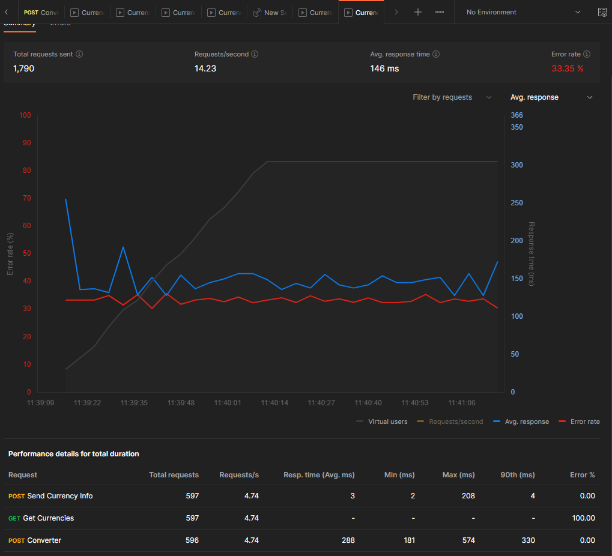

# Currency Converter Backend

This repository contains the backend code for the Currency Converter project. It is built with Spring Boot and handles the currency conversion logic and API endpoints.

## Frontend Repository

The front-end code for the Currency Converter project is available in a separate repository. You can find it [here](https://github.com/mohAnan-CS/Currency-Converter-Frontend). Make sure to clone and set up the front-end repository alongside this backend repository to run the complete application.

## Installation

1. Clone this repository: `git clone https://github.com/your-username/currency-converter-backend.git`
2. Navigate to the project directory: `cd currency-converter-backend`
3. Install the required dependencies using Maven: `mvn install`

## Usage

1. Start the Spring Boot application: `mvn spring-boot:run`
2. The backend server will be running at `http://localhost:8080`.

## Testing

### Unit Testing with JUnit and Mockito

**1.** Unit test cases using the JUnit and Mockito frameworks in `src/test/java/com/birzeit/currencyconvertertesting/service.
**2.** To generate JUnit HTML reports for the backend unit tests, please follow these steps:-
   
   **2.1** Make sure you have the Maven Surefire Report Plugin configured in your project's `pom.xml` file.
   
         
         </build>
         
         <reporting>
            <plugins>
               <plugin>
                   <groupId>org.apache.maven.plugins</groupId>
                   <artifactId>maven-surefire-report-plugin</artifactId>
                   <version>3.1.2</version>
               </plugin>
           </plugins>
         </reporting>
      
         <plugins>
               ...
               <plugin>
                   <groupId>org.apache.maven.plugins</groupId>
                   <artifactId>maven-surefire-report-plugin</artifactId>
                   <version>3.1.2</version>
               </plugin>
               ...
           </plugins>

   **2.2** Run the following commands to execute the unit test :
   
      ```bash
         mvn clean test surefire-report:report 
      ```
      
   **2.3** After the command complete then Run the following commands to generate HTML report :
   
      ```bash
         mvn surefire-report:report 
      ```

**3.** The Maven Surefire Report Plugin will generate JUnit HTML reports in the `target/site` directory.

#### *Note: Java JDK 17 and Maven Configuration*

To generate HTML reports using this library, please ensure the following:

**1.** Java JDK 17: Make sure you have Java JDK version 17 installed on your system. The HTML report generation feature relies on Java 17-specific features. You can check your Java version by running the following command in your terminal or command prompt:

   ```bash
   java -version
   ```

**2.** Maven Configuration: Ensure that your Maven installation is using Java JDK 17. To verify this, run the following command in your terminal or command prompt:

   ```bash
   mvn -version
   ```


#### Here is the HTML report :


### Loading Testing with Postman

To perform loading testing on the website using Postman, please follow these steps:

1. Make sure you have Postman installed on your local machine. If you don't have it installed, you can download it from the [Postman website](https://www.postman.com/downloads/).

2. Open Postman and create a new request to test the website's loading.

3. Set the request method, URL, headers, and any necessary request parameters or body according to your website's API or endpoints.

4. Set up the desired load testing scenarios, such as the number of concurrent users or the number of requests per second, depending on the load testing requirements.

5. Run the load test and observe the website's performance, response times, and any errors or issues encountered during the test.

6. Optionally, you can generate a report using the built-in reporting feature of Postman to capture and share the load test results. You may refer to the Postman documentation for more information on generating reports.

By performing loading testing using Postman, you can assess the website's performance and ensure it can handle the expected load and traffic effectively.

#### Here is Dashboard for load testing using postman :




## Contributing

Contributions are welcome! If you have any ideas, suggestions, or bug reports, please open an issue or submit a pull request.

## License

This project is licensed under the [MIT License](https://opensource.org/licenses/MIT).
