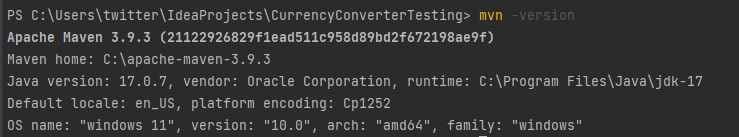
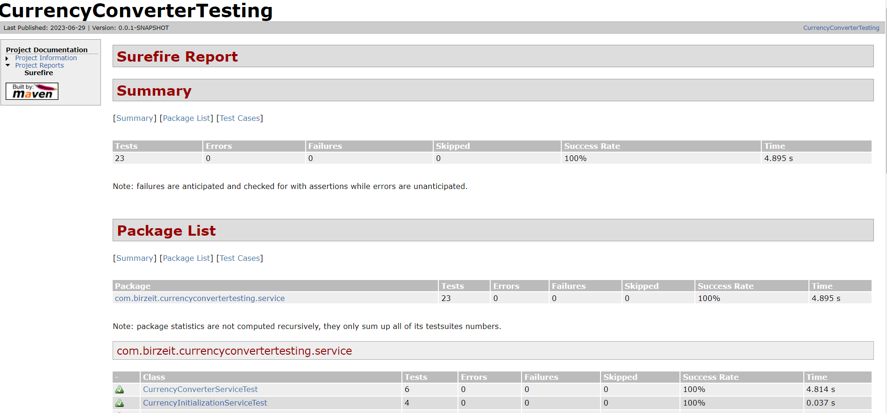
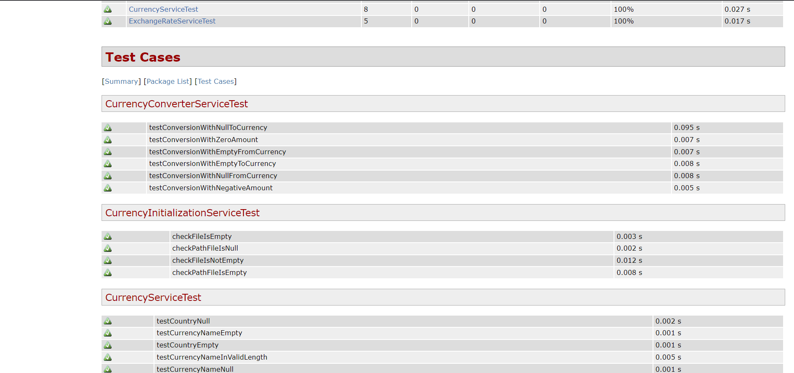
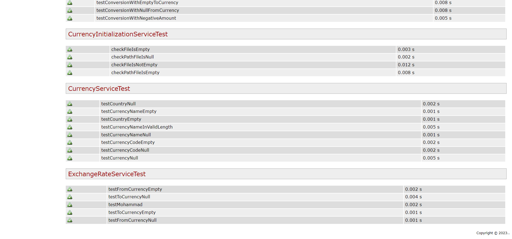

# Currency Converter Backend

This repository contains the backend code for the Currency Converter project. It is built with Spring Boot and handles the currency conversion logic and API endpoints.

## Frontend Repository

The front-end code for the Currency Converter project is available in a separate repository. You can find it [here](https://github.com/mohAnan-CS/Currency-Converter-Frontend). Make sure to clone and set up the front-end repository alongside this backend repository to run the complete application.

## Installation

1. Clone this repository: `git clone https://github.com/your-username/currency-converter-backend.git`
2. Navigate to the project directory: `cd currency-converter-backend`
3. Install the required dependencies using Maven: `mvn install`

## Usage

1. Start the Spring Boot application: `mvn spring-boot:run`
2. The backend server will be running at `http://localhost:8080`.

## Testing

### Unit Testing with JUnit and Mockito

**1.** Unit test cases using the JUnit and Mockito frameworks in `src/test/java/com/birzeit/currencyconvertertesting/service.
**2.** To generate JUnit HTML reports for the backend unit tests, please follow these steps:-
   
   **2.1** Make sure you have the Maven Surefire Report Plugin configured in your project's `pom.xml` file.
   
      ```XML
      ...
      </build>
      
      <reporting>
         <plugins>
            <plugin>
                <groupId>org.apache.maven.plugins</groupId>
                <artifactId>maven-surefire-report-plugin</artifactId>
                <version>3.1.2</version>
            </plugin>
        </plugins>
      </reporting>
      ...
      <plugins>
            ...
            <plugin>
                <groupId>org.apache.maven.plugins</groupId>
                <artifactId>maven-surefire-report-plugin</artifactId>
                <version>3.1.2</version>
            </plugin>
            ...
        </plugins>
      ```
      
   **2.2** Run the following commands to execute the unit test :
   
      ```bash
         mvn clean test surefire-report:report 
      ```
      
   **2.3** After the command complete then Run the following commands to generate HTML report :
   
      ```bash
         mvn surefire-report:report 
      ```

**3.** The Maven Surefire Report Plugin will generate JUnit HTML reports in the `target/site` directory.

#### *Note: Java JDK 17 and Maven Configuration*

To generate HTML reports using this library, please ensure the following:

**1.** Java JDK 17: Make sure you have Java JDK version 17 installed on your system. The HTML report generation feature relies on Java 17-specific features. You can check your Java version by running the following command in your terminal or command prompt:

   ```bash
   java -version
   ```

**2.** Maven Configuration: Ensure that your Maven installation is using Java JDK 17. To verify this, run the following command in your terminal or command prompt:

   ```bash
   mvn -version
   ```



#### Here is the HTML report :







### Load Testing with Postman

1. Use Postman to perform load testing on the backend API.
2. Create Postman collections with the required test scenarios.
3. Execute the collections with a varying number of concurrent requests to simulate load.
4. Generate the test report using Postman's built-in reporting feature.
5. To add images to the report:
   - Capture screenshots during the load testing scenarios.
   - Include the screenshots in the report by referencing them in the report description or using the appropriate image embedding feature.

## Contributing

Contributions are welcome! If you have any ideas, suggestions, or bug reports, please open an issue or submit a pull request.

## License

This project is licensed under the [MIT License](https://opensource.org/licenses/MIT).
